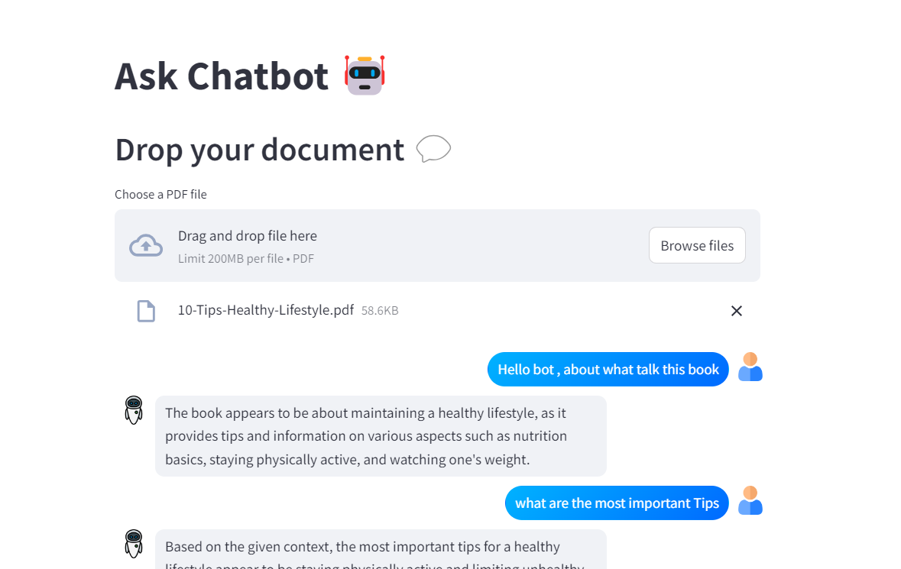

# ChatBot-withdoc

An interactive chatbot built with Streamlit and LLMs (like LLaMA 3) that examines documents and provides detailed information based on their content. The chatbot analyzes user-uploaded documents and offers insights and summaries using advanced language models.

## Screenshots

Here are some screenshots of the application:

