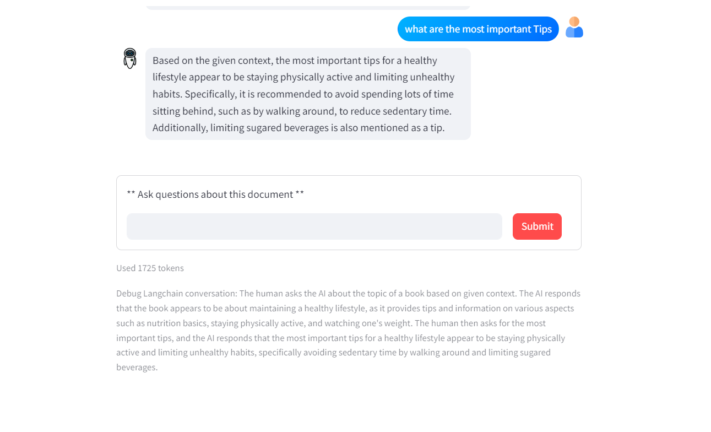

# ChatBot-withdoc

An interactive chatbot built with Streamlit and LLaMA 3. This chatbot allows users to upload documents and provides a thorough examination of their content. It can analyze documents to extract key information, generate summaries, answer questions related to the content, and provide insights based on the data provided in the documents. The chatbot is designed to be user-friendly, making it easy for users to interact and explore the information contained within their documents.

## Screenshots

Here are some screenshots of the application:

